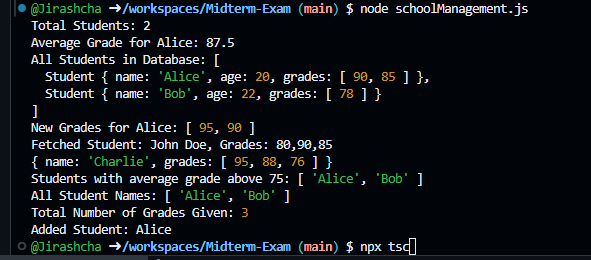

# Midterm-Exam
- Midterm Exam, CS319 sec.427C, 
- 1640702609 Jirashcha Wanggum
- https://docs.google.com/document/u/0/d/1mxlv2FcSl3CISu9tE6eX-XhOIJMfq9LB2fs6ldK2SYg/mobilebasic


# School Management System

## Overview
The School Management System is a TypeScript application that helps manage student and teacher data, calculate grades, and provides dynamic interactivity on the front end using jQuery. The system allows administrators to track students, assign grades, and display information efficiently.

## Features
- **Student Management**: Create, update, and calculate average grades for students.
- **Teacher Management**: Assign grades to students.
- **Admin Interface**: Admin information display.
- **Database Simulation**: Store and retrieve students and teachers using a generic database class.
- **Asynchronous Data Fetching**: Simulate fetching student data from an API.
- **Array Manipulation**: Utilize array methods to process student data effectively.
- **Error Handling**: Robust JSON parsing with error handling.
- **Dynamic UI Interaction**: Simulate adding student names to a list using jQuery.

## Technologies Used
- TypeScript
- jQuery
- Node.js

## Installation
- 1. Clone the repository:
   ```bash
   git clone https://github.com/yourusername/Midterm-Exam.git

- 2. Navigate to the project directory
   ```bash
    cd Midterm-Exam

- 3.Install dependencies:
   ```bash
    npm install

## Usage
- To compile the TypeScript files and run the application, use the following commands:
- 1. Compile the TypeScript file:
   ```bash
    npx tsc schoolManagement.ts
- 2. Run the compiled JavaScript file:
   ```bash
    node schoolManagement.js

## Functions
- addGrade(grade: number): Adds a grade to the student's grades array.
- getAverageGrade(): Calculates and returns the student's average grade.
- assignGrades(student: Student, grade: number): Assigns a grade to a specific student.
- fetchStudentData(): Simulates fetching student data from an API.
- parseJSONData(jsonData: string): Parses JSON data and handles errors.
- processStudents(students: Student[]): Processes student data using array methods.

## Sample Output
- 

## License
- This project is licensed under the MIT License. See the LICENSE file for details.

## Acknowledgments
- TypeScript Documentation
- jQuery Documentation


